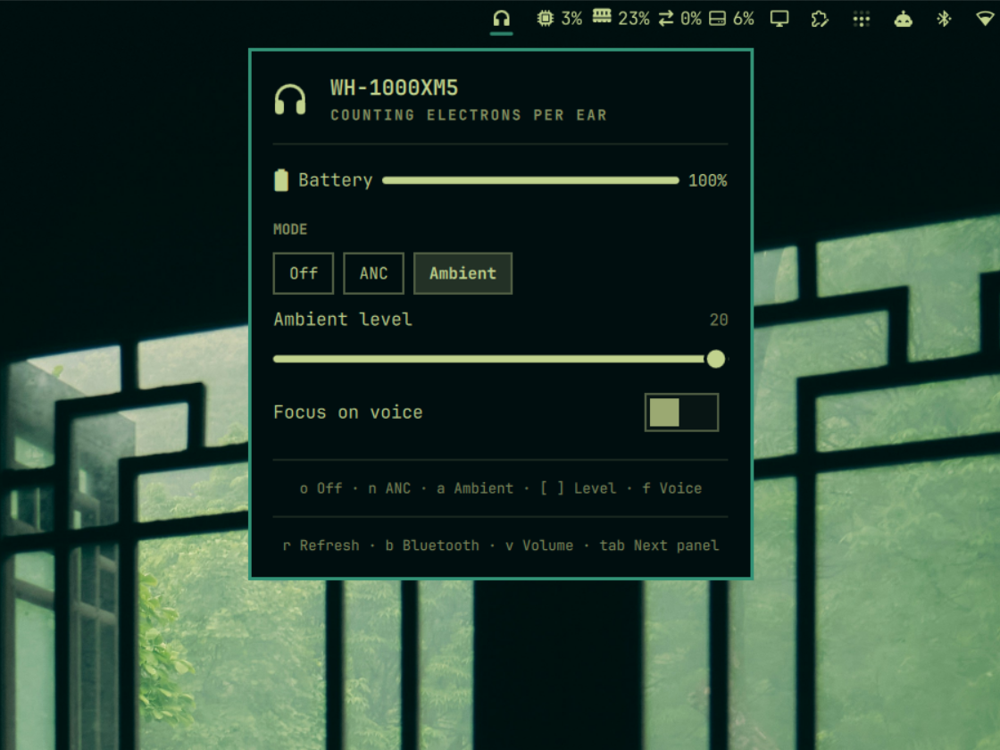
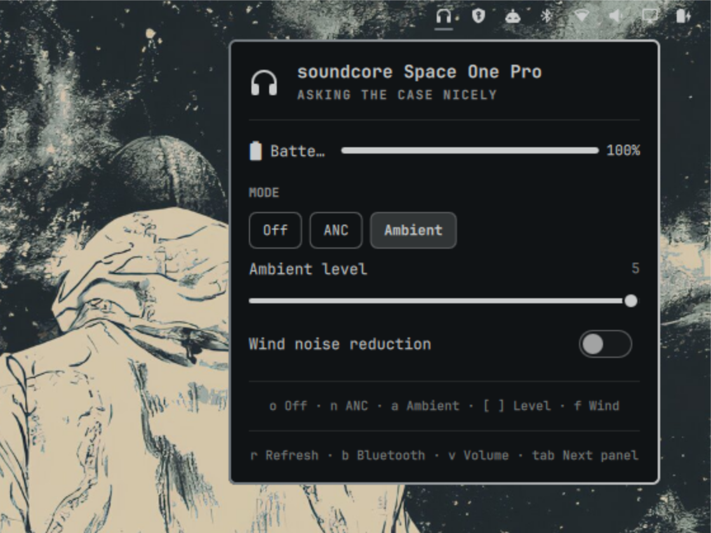
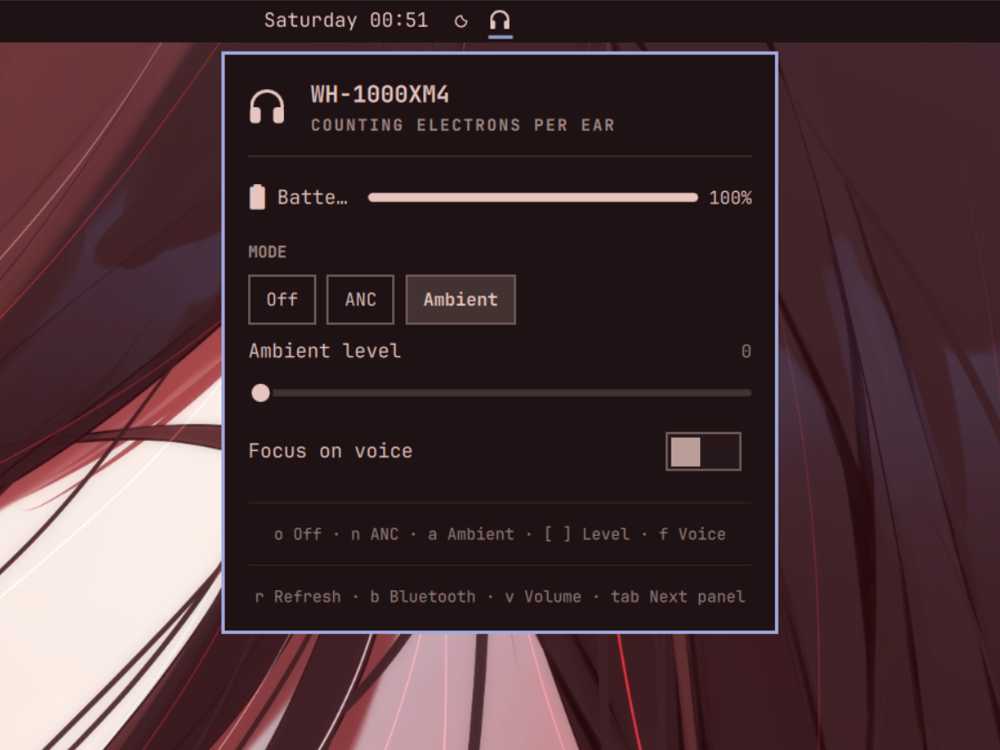
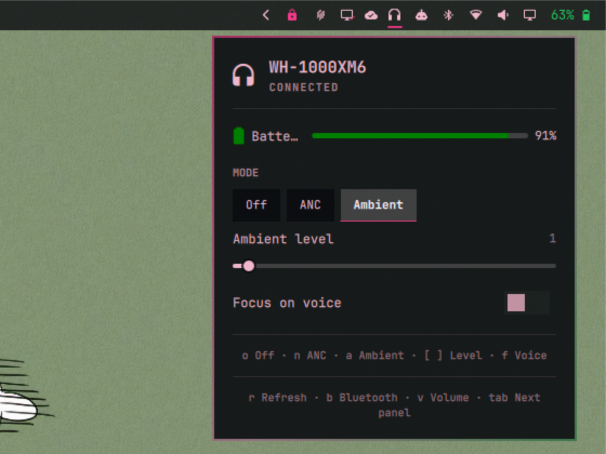
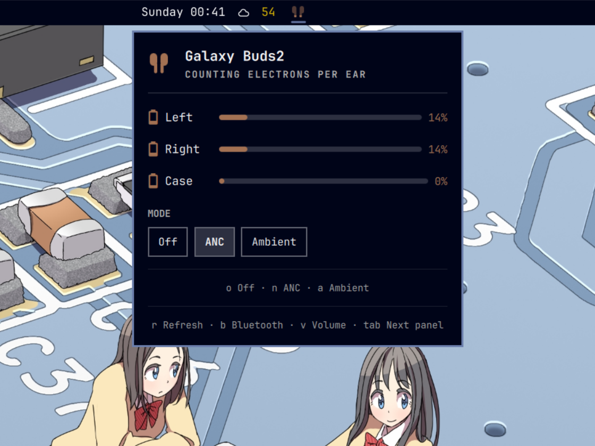
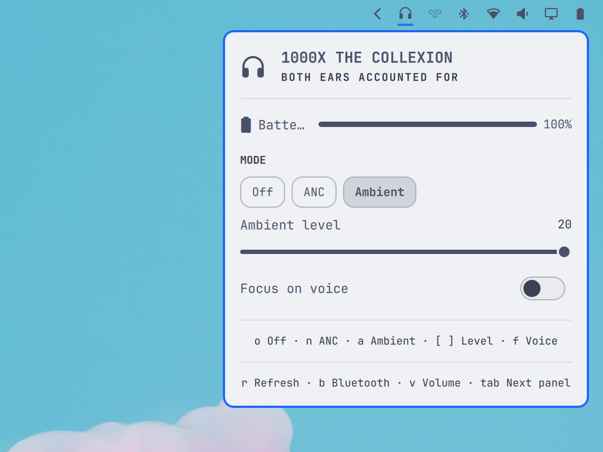
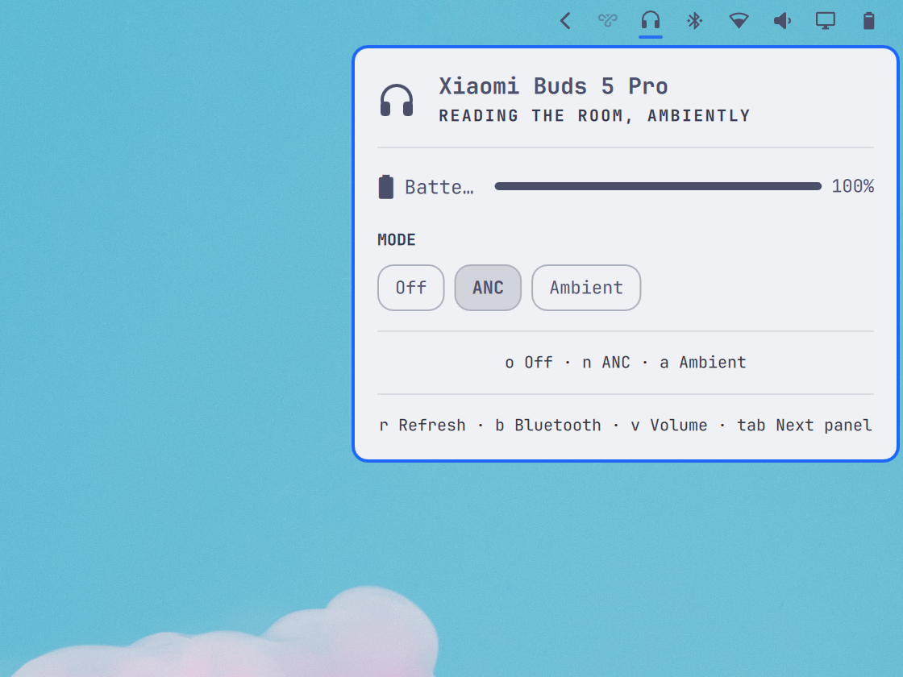
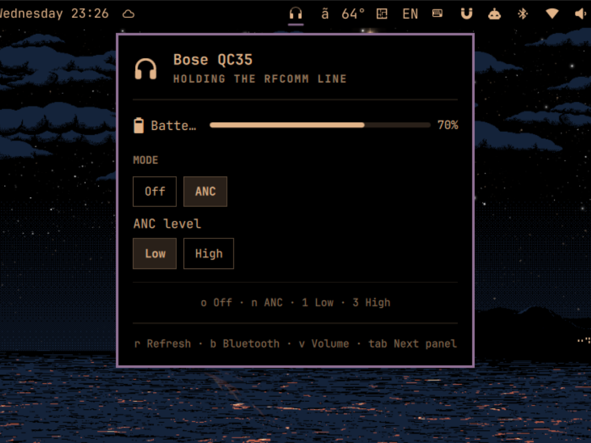

# Omaphones for Omarchy

<p align="center"><b>JBL</b> &nbsp;·&nbsp; <b>Sony</b> &nbsp;·&nbsp; <b>Samsung</b> &nbsp;·&nbsp; <b>Nothing / CMF</b> &nbsp;·&nbsp; <b>Soundcore</b> &nbsp;·&nbsp; <b>Xiaomi</b> &nbsp;·&nbsp; <b>OPPO</b> &nbsp;·&nbsp; <b>Bose</b></p>

<p align="center"><b>Battery levels and noise-cancellation control for Bluetooth headphones, in the Omarchy bar.</b></p>

**Install** — copy into a terminal and run:

```bash
omarchy plugin add https://github.com/ncr/omarchy-headphones --enable
```

**Update** an installed copy:

```bash
omarchy plugin update io.github.ncr.omaphones --yes && omarchy restart shell
```

Headphones not on the list? [Add yours](#add-your-own-headphones).

<p align="center"><a href="#what-it-does">What it does</a> · <a href="#supported-headphones">Supported headphones</a> · <a href="#in-the-panel">In the panel</a> · <a href="#settings">Settings</a> · <a href="#gallery">Gallery</a> · <a href="#add-your-own-headphones">Add your headphones</a></p>

## Gallery

<table>
<tr>
<td width="50%"></td>
<td width="50%"></td>
</tr>
<tr>
<td align="center">JBL TUNE230NC TWS — <a href="https://github.com/ncr">@ncr</a></td>
<td align="center">Sony WH-CH720N — <a href="https://github.com/ncr">@ncr</a></td>
</tr>
<tr>
<td width="50%"></td>
<td width="50%"></td>
</tr>
<tr>
<td align="center">Soundcore Space 2 — <a href="https://github.com/Sovego">@Sovego</a></td>
<td align="center">Nothing Ear (a) — <a href="https://github.com/Jenesaispas69">@Jenesaispas69</a></td>
</tr>
<tr>
<td width="50%"></td>
<td width="50%"></td>
</tr>
<tr>
<td align="center">Sony WH-1000XM5 — <a href="https://github.com/huynguyendinhquang">@huynguyendinhquang</a></td>
<td align="center">soundcore Space One Pro — <a href="https://github.com/sasiruLK">@sasiruLK</a></td>
</tr>
<tr>
<td width="50%"></td>
<td width="50%"></td>
</tr>
<tr>
<td align="center">Sony WH-1000XM4 — <a href="https://github.com/seth-reee">@seth-reee</a></td>
<td align="center">Sony WH-1000XM6 — <a href="https://github.com/f-iacono">@f-iacono</a></td>
</tr>
</table>

<table>
<tr>
<td width="50%"></td>
<td width="50%"></td>
</tr>
<tr>
<td align="center">Samsung Galaxy Buds2 — <a href="https://github.com/seth-reee">@seth-reee</a></td>
<td align="center">Sony 1000X The Collexion — <a href="https://github.com/KentoNion">@KentoNion</a></td>
</tr>
</table>

<table>
<tr>
<td width="50%"></td>
<td width="50%"></td>
</tr>
<tr>
<td align="center">Xiaomi Buds 5 Pro — <a href="https://github.com/KentoNion">@KentoNion</a></td>
<td align="center">OPPO Enco Air3 Pro — <a href="https://github.com/Aryan447">@Aryan447</a></td>
</tr>
</table>

<table>
<tr>
<td width="50%"></td>
<td width="50%"></td>
</tr>
<tr>
<td align="center">CMF Headphone Pro — <a href="https://github.com/adilahmad17">@adilahmad17</a><br><small>Original capture; low-latency row partly cropped.</small></td>
<td align="center">Bose QC45 — <a href="https://github.com/Driskol">@Driskol</a></td>
</tr>
</table>

<table>
<tr>
<td width="50%"></td>
<td width="50%"></td>
</tr>
<tr>
<td align="center">Sony WH-CH520 — <a href="https://github.com/enobale">@enobale</a></td>
<td align="center">CMF Buds 2 — <a href="https://github.com/HanzGeeratz">@HanzGeeratz</a></td>
</tr>
</table>

<table>
<tr>
<td width="50%"></td>
<td width="50%"></td>
</tr>
<tr>
<td align="center">JBL Wave Buds 2 — <a href="https://github.com/carlosr-sh">@carlosr-sh</a></td>
<td align="center">soundcore Life Q30 — <a href="https://github.com/kevinbsr">@kevinbsr</a></td>
</tr>
</table>

<table>
<tr>
<td width="50%"></td>
<td width="50%"></td>
</tr>
<tr>
<td align="center">Bose QC35 — <a href="https://github.com/pedrohfp">@pedrohfp</a></td>
<td align="center"></td>
</tr>
</table>

## What it does

- **Battery level** — per earbud and the case, or the single battery of
  over-ear headphones.
- **The bar icon is the meter** — earbuds are drawn as a pair, a headset as
  headphones, filling up as they charge. Readable from the bar without opening
  anything.
- **Noise control** — Off / ANC / Ambient / TalkThru, from the panel or a key.
  JBL, Sony, Samsung, Nothing / CMF, Soundcore, Xiaomi Buds 5 Pro, OPPO Enco Air3 Pro,
  Bose QC45 and Bose QC35 today; built to learn
  your brand. Sony and Soundcore add the ambient level with Focus on Voice or
  wind noise reduction; Nothing / CMF the ANC strength (Low / Mid / High / Adaptive)
  and a low-latency switch, and the Bose QC35 grades its ANC Low or High.
- **Pause when you take them off, resume when you put them back on** — on a
  headset with a wear sensor (confirmed on the Sony WH-1000XM6). Only the
  players the sensor paused are resumed. Any headphones pause what is playing
  when they disconnect.
- **Several headphones at once** — one icon per connected set, each with its own
  panel.
- **Low-battery notification** that names the earbud.
- **Scriptable** — `omarchy-shell omaphones status`, `omarchy-shell omaphones setMode anc`, and so on.

For AirPods use [omapods](https://github.com/thisisgm/omarchy-pods) instead: the
same idea, built for Apple's own protocol, and the plugin this one is modelled on.

<picture>
  <source media="(prefers-color-scheme: dark)" srcset="docs/hero-dark.webp">
  
</picture>

## Supported headphones

| Device                      | Battery                                                               | Noise control                                                                                   | Confirmed by                   |
|:----------------------------|:----------------------------------------------------------------------|:------------------------------------------------------------------------------------------------|:-------------------------------|
| JBL TUNE230NC TWS (earbuds) |  left, right, case |  Off · ANC · Ambient · TalkThru              | [@ncr](https://github.com/ncr) |
| JBL Wave Buds 2 (earbuds)   |  left, right, case |  Off · ANC · Ambient · TalkThru              | [@carlosr-sh](https://github.com/carlosr-sh) |
| Sony WH-CH720N (over-ear)   |  one figure        |  Off · ANC · Ambient (level, Focus on Voice) | [@ncr](https://github.com/ncr) |
| Sony WH-1000XM5 (over-ear)  |  one figure        |  Off · ANC · Ambient (level, Focus on Voice) | [@huynguyendinhquang](https://github.com/huynguyendinhquang) |
| Sony WH-1000XM6 (over-ear)  |  one figure        |  Off · ANC · Ambient (level, Focus on Voice) · wear pause/resume | [@f-iacono](https://github.com/f-iacono) |
| Sony WH-1000XM4 (over-ear)  |  one figure        |  Off · ANC · Ambient                          | [@seth-reee](https://github.com/seth-reee) |
| Sony 1000X The Collexion (over-ear) |  one figure        |  Off · ANC · Ambient (level, Focus on Voice)   | [@KentoNion](https://github.com/KentoNion) |
| Samsung Galaxy Buds2 (earbuds) |  left, right, case |  Off · ANC · Ambient | [@seth-reee](https://github.com/seth-reee) |
| Soundcore Space 2 (over-ear)|  one figure        |  Off · ANC · Ambient (level, wind noise reduction) | [@Sovego](https://github.com/Sovego) |
| Xiaomi Buds 5 Pro (earbuds) |  one figure        |  Off · ANC · Ambient                          | [@KentoNion](https://github.com/KentoNion)|
| OPPO Enco Air3 Pro (earbuds) |  left, right, case |  Off · ANC · Ambient | [@Aryan447](https://github.com/Aryan447) |
| Bose QC45 (over-ear)         |  one figure        |  ANC · Ambient (no Off) | [@Driskol](https://github.com/Driskol) |
| Bose QC35 (over-ear)         |  one figure        |  Off · ANC (Low / High) — no Ambient | [@pedrohfp](https://github.com/pedrohfp) |
| Nothing Ear (a) (earbuds)   |  left, right, case |  Off · ANC (Low / Mid / High / Adaptive) · Ambient · low latency | [@Jenesaispas69](https://github.com/Jenesaispas69) |
| CMF Headphone Pro (over-ear) |  one figure |  Off · ANC (Low / Mid / High / Adaptive) · Ambient · low latency | [@adilahmad17](https://github.com/adilahmad17) |
| CMF Buds 2 (earbuds)         |  left, right, case |  Off · ANC (Low / Mid / High / Adaptive) · Ambient · low latency | [@HanzGeeratz](https://github.com/HanzGeeratz) |
| Nothing Ear · Headphone (1) |  expected (one figure on Headphone (1)) |  expected — same protocol, per [omarchy-nothing-ear](https://github.com/r-witz/omarchy-nothing-ear) | — |
| soundcore Space One Pro (A3062, over-ear) |  one figure |  Off · ANC · Ambient (level, wind noise reduction) | [@sasiruLK](https://github.com/sasiruLK) |
| soundcore Life Q30 (A3028, over-ear) |  one figure (Fast Pair) |  Off · ANC · Ambient | [@kevinbsr](https://github.com/kevinbsr) |
| Sony WH-CH520             |  one figure (BlueZ) |  none — Sony lists no ANC/Ambient on this model, confirmed on hardware | [@enobale](https://github.com/enobale) |
| other Fast Pair headphones  |  expected          |                                     | —                              |

CMF Headphone Pro's connection, reconnect recovery and all panel controls were
[confirmed on hardware by its owner](https://github.com/ncr/omarchy-headphones/pull/12#issuecomment-5627277481).
See [the test record and remaining limits](docs/CMF-REVIEW.md).

## Add your own headphones

Use `/add-new-bridge` in Codex or Claude, or ask your agent to read
[the shared skill](.agents/skills/add-new-bridge/SKILL.md). It first checks
whether an existing bridge suffices, then guides capture, tests and owner validation.

Paste the text below into your AI coding agent (Claude Code, Codex, OpenCode…).
It adds support for your headphones and opens a pull request here. How the
existing protocols were found is written down in [PROTOCOL.md](PROTOCOL.md).

```text
Add support for my Bluetooth headphones to the Omaphones plugin for Omarchy and
open a pull request against `github.com/ncr/omarchy-headphones` with the result.
0. If it is not installed yet: `omarchy plugin add
   https://github.com/ncr/omarchy-headphones --enable --yes` (`--yes` because you
   have no terminal to confirm in). It lands in
   `~/.config/omarchy/plugins/io.github.ncr.omaphones`.
1. Connect the headphones and check `omarchy-shell omaphones status`. Find out
   what they serve: `bluetoothctl devices` for the address, `bluetoothctl info
   <address>` for the UUIDs — `df21fe2c-2515-4fdb-8886-f12c4d67927c` is the
   Google Fast Pair Message Stream (battery), `956c7b26-d49a-4ba8-b03f-b17d393cb6e2`
   is Sony MDR v2 and `96cc203e-5068-46ad-b32d-e316f5e069ba` Sony MDR v1 (both
   noise control), `2e73a4ad-332d-41fc-90e2-16bef06523f2` is Samsung SPPNew,
   `aeac4a03-dff5-498f-843a-34487cf133eb` is Nothing NT Link, a UUID
   starting `0cf12d31-fac3-4553-bd80-d6832e7` is Soundcore's vendor channel;
   JBL earbuds are probed over BLE by the plugin itself.
2. If battery and the mode row both already work, no bridge change is needed.
   Still bring my device's own capture, pin and confirmed capabilities from
   step 3, plus its README row and the screenshot from step 4.
3. Follow `.agents/skills/add-new-bridge/SKILL.md` in the repository.
   Read `AGENTS.md` in the plugin directory
   first: it is the map — which files a new model or a new brand touches,
   the bridge contract (`BRIDGE.md`), how a session is pinned
   (`tests/pins/`), and `tools/check`, the one command that runs everything
   a pull request is held to. Run `tools/check` until it passes; CI runs the
   same script on the pull request.

   The canonical examples are JBL TUNE230NC TWS and Sony WH-CH720N,
   prepared and hardware-tested by the maintainer @ncr on his own headphones.
   Read `docs/CANONICAL-TESTS.md`, their `*-canonical.json` pins, captured
   packets and shared fault/battery tests. Match their coverage for the
   capabilities my model actually offers: all mode replies, battery shape,
   malformed/partial data, unsolicited changes, silence vs disconnect,
   recovery and isolation from another device. Use my device's own frames;
   canonical means a coverage example, not permission to reuse their bytes.
   Record a live test with device-reported results and restored settings;
   clearly list anything untested or not applicable. Preserve all existing pins.
   These expanded requirements apply to new models and brands. Existing
   supported models keep their current coverage; do not require historical
   gaps to be filled. Changes to an existing model need tests for the changed
   behaviour and its owner's confirmation, while preserving its existing pins.

   Two rules hold whatever brand this is, because nobody has more than their
   own headphones — the maintainer cannot test mine and I cannot test
   anybody else's — and a pull request that breaks either will be sent back:

   **A new model may not change what an existing one is sent.** Somebody
   else's headphones work today on frames nobody here can retest. A model
   gets its own row (`MODELS` in its bridge) and its own pin file
   (`tests/pins/<brand>/<model>.json`, the frozen session of its owner's
   headphones); adding mine adds a row and a file, it does not edit another
   owner's. Where something must be decided, let it widen rather than
   narrow: prefer asking one more question to asking one fewer.

   **Ship only what you saw the headphones answer — no guessed bytes.** A
   variant from a vendor table that my headset never answered stays out, in
   the code and in `PROTOCOL.md` both. Keep the probe's output as
   `docs/captures/<brand>-<model>.txt` and name it from the pin.

   Mind that any file written inside the plugin directory reloads the plugin
   at once — edit elsewhere and move files in, as the tools in `tools/` do.
4. Take the screenshot: `tools/gallery-shot <which>` — the `gallery-screenshot`
   skill in `.claude/skills/` has the steps — and add it to the Gallery at the
   bottom of `README.md` with the device name and my handle. The screenshot is
   part of the pull request.
5. Commit, push to a fork, and open the pull request.
```

Negative results are welcome too — a row saying what does not work saves the
next person the afternoon.

## In the panel

The icon is the meter:

<table>
<tr>
<td width="96"></td>
<td><b>Earbuds</b> — each bud fills with its own level. Here left 40%, right 75%.</td>
</tr>
<tr>
<td width="96"></td>
<td><b>Headset</b> — one battery, whole mark. Here 60%.</td>
</tr>
<tr>
<td width="96"></td>
<td><b>Low</b> — under the threshold (20% by default) the icon turns the theme's alert colour and a notification fires. Here 12% and 8%.</td>
</tr>
</table>

Keys, while the panel is open (the panel lists them itself, bottom rows):


| Key | Does |
|:--|:--|
| `o` `n` `a` `t` | Off · ANC · Ambient · TalkThru — only the modes this device has |
| `[` `]` | Ambient level down / up (Sony 0-20, Soundcore 1-5) |
| `f` | Focus on voice (Sony) / wind noise reduction (Soundcore) on / off |
| `1` `2` `3` `4` | ANC strength: Low · Mid · High · Adaptive (Nothing / CMF) — turns ANC on at it |
| `g` | Low latency on / off (Nothing / CMF) |
| `r` | Ask the device again |
| `,` `.` | Previous / next connected set |
| `b` `v` | Bluetooth panel / Audio panel |
| `tab` `esc` | Next panel / close |

Click an icon to open its panel; with two sets connected, click the one you mean.

Everything is reachable over IPC — `omarchy-shell omaphones <method>`:

| Method | Answers |
|:--|:--|
| `status` | one line per device it follows, e.g. `JBL TUNE230NC TWS · L 90% · R 100% · case 78%` |
| `battery` · `left` · `right` · `batteryCase` | a level 0-100, or `-1` |
| `charging` | which parts say they are charging |
| `mode` · `setMode <m>` | `off` `anc` `ambient` `talkthru`, or `pending` / `unsupported` · `ok` / `busy` / `unavailable` |
| `ambientLevel` · `setAmbientLevel <n>` | 0-20 (Sony), 1-5 (Soundcore) |
| `ambientVoice` · `setAmbientVoice on\|off` | `on` / `off` — Focus on voice (Sony), wind noise reduction (Soundcore) |
| `ancLevel` · `setAncLevel <l>` | `low` `mid` `high` `adaptive` (Nothing / CMF); setting one turns ANC on |
| `latency` · `setLatency on\|off` | `on` / `off` (Nothing / CMF) |
| `worn` | `worn` / `not worn`, or `unsupported` for a device with no wear sensor |
| `refresh` | ask the device again |
| `open` · `close` · `toggle` | the panel |

With more than one set connected, every method that reads or writes a device
has a `…For <which>` twin that names a device by a piece of its name, address or brand: `modeFor sony`,
`setModeFor anc jbl`, `openFor jbl`.

The table is the useful subset — `Service.qml` answers a few more
introspection calls (`bleAddress`, `panelRect`) for the tools in `tools/`.

What it deliberately does not do — connect, volume, MAC addresses, equalisers —
lives in the stock panels a keypress away (`b`, `v`).

## Settings

`omarchy bar set io.github.ncr.omaphones <key> <value>` (add `--json` for numbers
and booleans), or the widget's entry in `~/.config/omarchy/shell.json`.

| Key                    | Default | Meaning                                                                                                                  |
|:-----------------------|:--------|:-------------------------------------------------------------------------------------------------------------------------|
| `deviceMatch`          | `""`    | Substring of name or address; empty shows every connected audio device, set it to follow only the matching ones.         |
| `useFastPair`          | `true`  | Battery over Fast Pair. Off: battery from a supported noise-control bridge while `useModeControl` is on, otherwise BlueZ's single figure if available. No Fast Pair reader or JBL mode row (its BLE address is announced there). |
| `useModeControl`       | `true`  | The mode row (noise control) and the link behind it.                                                                           |
| `lowBatteryThreshold`  | `20`    | Urgent icon and notification from here down (5-50).                                                                      |
| `showPercentage`       | `false` | A written percentage instead of the drawn meter; costs a bar slot.                                                       |
| `hideWhenDisconnected` | `true`  | Drop the widget while nothing is connected.                                                                              |
| `notifyLowBattery`     | `true`  | Send the notification.                                                                                                   |
| `pauseMediaOnDisconnect` | `true` | Pause playing media players when a device disconnects or comes off the ears, and resume the same players when it goes back on. |

## Credits

- [omapods](https://github.com/thisisgm/omarchy-pods) — the idea and the shape.
- [Bluetooth-Battery-Meter](https://github.com/maniacx/Bluetooth-Battery-Meter) — the clearest reading of the Fast Pair battery bytes.
- [bluetooth-py](https://github.com/GroupXyz2/bluetooth-py) — the JBL command numbers.
- [Gadgetbridge](https://codeberg.org/Freeyourgadget/Gadgetbridge) and [mos9527/SonyHeadphonesClient](https://github.com/mos9527/SonyHeadphonesClient) — the Sony frame format; the two disagree about the WH-CH720N, and the hardware settled it here.
- [@f-iacono](https://github.com/f-iacono) — WH-1000XM6 protocol capture and wear-sensor support.
- [r-witz/omarchy-nothing-ear](https://github.com/r-witz/omarchy-nothing-ear) — the Nothing protocol as a working Omarchy widget: battery components, the latency switch and the case cache; [DaanHessen/earctl](https://github.com/DaanHessen/earctl) — the command table; [@Jenesaispas69](https://github.com/Jenesaispas69)'s [PR #2](https://github.com/ncr/omarchy-headphones/pull/2) — the NT Link UUID and the frame layout from an Ear (a).
- [Leaf-lsgtky/OppoPods](https://github.com/Leaf-lsgtky/OppoPods) — the HeyMelody ANC query (`0x010C`) and the `01 01` window this headset answers; [Swastik36/OPPO-Earbuds](https://github.com/Swastik36/OPPO-Earbuds) — the OPOv1 framing and the battery query.

## Licence

MIT. See [LICENSE](LICENSE).
