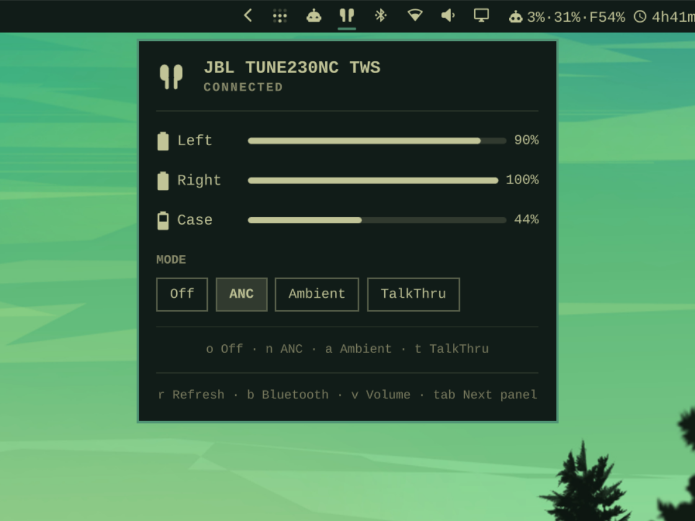
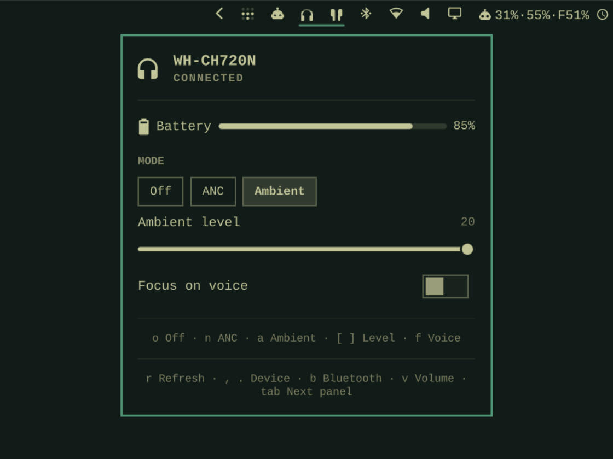
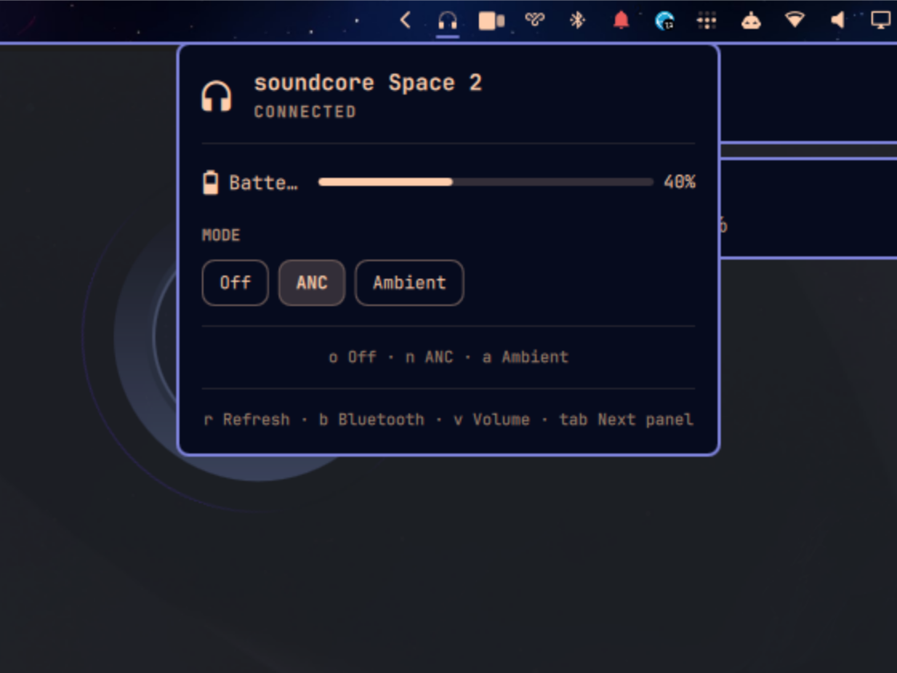
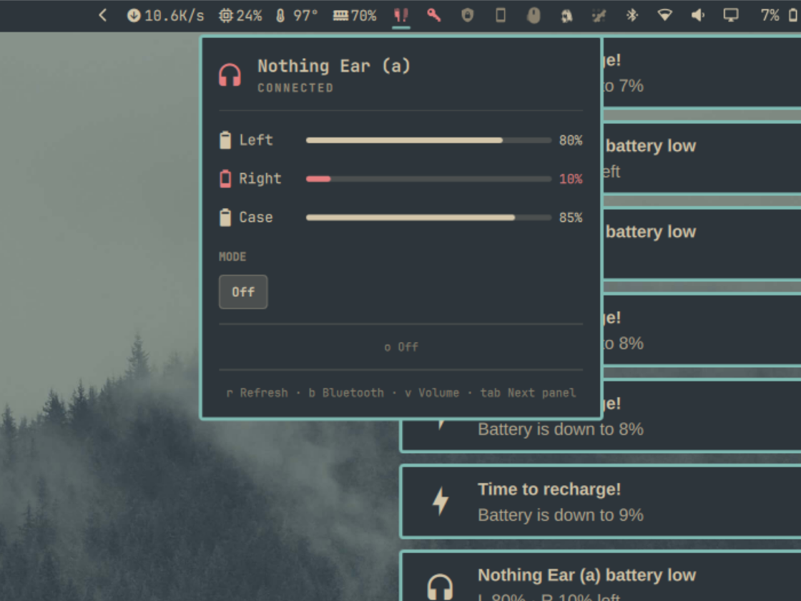
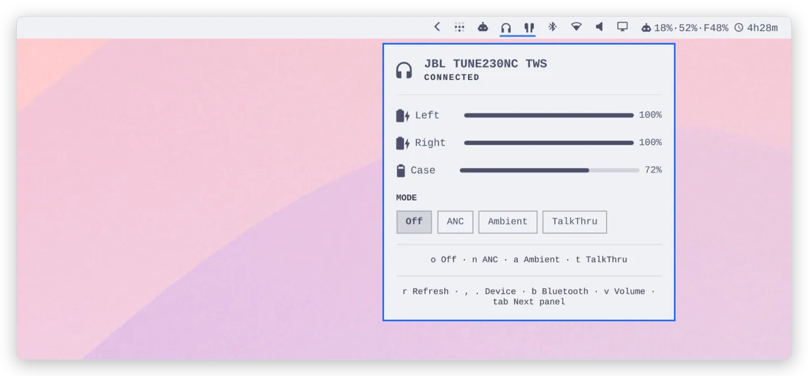
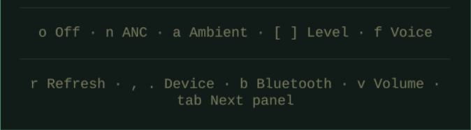

# Omaphones for Omarchy

<p align="center"><b>JBL</b> &nbsp;·&nbsp; <b>Sony</b> &nbsp;·&nbsp; <b>Nothing</b> &nbsp;·&nbsp; <b>Soundcore</b> &nbsp;·&nbsp; <b>Xiaomi</b></p>

<p align="center"><b>Battery levels and noise-cancellation control for Bluetooth headphones, in the Omarchy bar.</b></p>

To install, copy this into a terminal and run it:

```bash
omarchy plugin add https://github.com/ncr/omarchy-headphones --enable
```

Headphones not on the list? [Add yours](#add-your-own-headphones).

<p align="center"><a href="#install">Install</a> · <a href="#what-it-does">What it does</a> · <a href="#supported-headphones">Supported headphones</a> · <a href="#in-the-panel">In the panel</a> · <a href="#settings">Settings</a> · <a href="#gallery">Gallery</a> · <a href="#add-your-own-headphones">Add your headphones</a></p>

## Gallery

<table>
<tr>
<td width="50%"></td>
<td width="50%"></td>
</tr>
<tr>
<td align="center">JBL TUNE230NC TWS — <a href="https://github.com/ncr">@ncr</a></td>
<td align="center">Sony WH-CH720N — <a href="https://github.com/ncr">@ncr</a></td>
</tr>
<tr>
<td width="50%"></td>
<td width="50%"></td>
</tr>
<tr>
<td align="center">Soundcore Space 2 — <a href="https://github.com/Sovego">@Sovego</a></td>
<td align="center">Nothing Ear (a) — <a href="https://github.com/Jenesaispas69">@Jenesaispas69</a></td>
</tr>
</table>

All taken the same way — `tools/gallery-shot <which>`: an empty workspace, the
device's panel open, a fixed 1120×840 frame. A pull request that adds headphones
adds its cell here, caption under it; the steps are in
`.claude/skills/gallery-screenshot/SKILL.md`. (The animation further down is the
JBL shot under a few themes, stitched by `tools/hero-set`; `tools/rebuild-visuals`
remakes every picture in this file after a change to the widget's look.)

## What it does

- **Battery level** — per earbud and the case, or the single battery of
  over-ear headphones.
- **The bar icon is the meter** — earbuds are drawn as a pair, a headset as
  headphones, filling up as they charge. Readable from the bar without opening
  anything.
- **Noise control** — Off / ANC / Ambient / TalkThru, from the panel or a key.
  JBL, Sony, Nothing, Soundcore and Xiaomi Buds 5 Pro today; built to learn
  your brand. Sony and Soundcore add the ambient level with Focus on Voice or
  wind noise reduction; Nothing the ANC strength (Low / Mid / High / Adaptive)
  and a low-latency switch.
- **Codec** — which A2DP codec carries the audio (SBC, AAC, LDAC…), for any
  set whose card PipeWire offers a choice on.
- **Several headphones at once** — one icon per connected set, each with its own
  panel.
- **Low-battery notification** that names the earbud.
- **Scriptable** — `omarchy-shell omaphones status`, `omarchy-shell omaphones setMode anc`, and so on.

For AirPods use [omapods](https://github.com/thisisgm/omarchy-pods) instead: the
same idea, built for Apple's own protocol, and the plugin this one is modelled on.

<picture>
  <source media="(prefers-color-scheme: dark)" srcset="docs/hero-dark.webp">
  
</picture>

## Install

```bash
omarchy plugin add https://github.com/ncr/omarchy-headphones --enable
```

Needs Omarchy 4.0 or later; everything else the plugin uses ships with it.

The widget is live as soon as the command returns — no shell restart. Updating an older version (`omarchy plugin update io.github.ncr.omaphones`) is
the one exception: run `omarchy restart shell` once afterwards, or the old code
keeps running.

Connect the headphones and the widget appears; it hides while nothing is
connected. `omarchy-shell omaphones status` tells you what it believes. If a
helper could not start, the panel prints why; fix it and press `r` in the panel
(or `omarchy-shell omaphones refreshFor <which>`) rather than waiting — a failed helper is
retried on a growing pause that can reach five minutes, and `r` brings the
next try forward. `omarchy plugin remove io.github.ncr.omaphones` takes it out
again — along with its settings, so note them first if you changed any.

## Supported headphones

| Device                      | Battery                                                               | Noise control                                                                                   | Confirmed by                   |
|:----------------------------|:----------------------------------------------------------------------|:------------------------------------------------------------------------------------------------|:-------------------------------|
| JBL TUNE230NC TWS (earbuds) |  left, right, case |  Off · ANC · Ambient · TalkThru              | [@ncr](https://github.com/ncr) |
| Sony WH-CH720N (over-ear)   |  one figure        |  Off · ANC · Ambient (level, Focus on Voice) | [@ncr](https://github.com/ncr) |
| Soundcore Space 2 (over-ear)|  one figure        |  Off · ANC · Ambient (level, wind noise reduction) | [@Sovego](https://github.com/Sovego) |
| Xiaomi Buds 5 Pro (earbuds) |  one figure        |  Off · ANC · Ambient                          | [@KentoNion](https://github.com/KentoNion)|
| Nothing Ear (a) (earbuds)   |  left, right, case |  Off · ANC (Low / Mid / High / Adaptive) · Ambient · low latency | [@Jenesaispas69](https://github.com/Jenesaispas69) |
| Nothing Ear · Headphone (1) |  expected (one figure on Headphone (1)) |  expected — same protocol, per [omarchy-nothing-ear](https://github.com/r-witz/omarchy-nothing-ear) | — |
| other Fast Pair headphones  |  expected          |                                     | —                              |

Battery works on anything that serves the Google Fast Pair Message Stream
(`bluetoothctl info <address>` lists `df21fe2c-…`) — most headphones do — and
falls back to BlueZ's single figure otherwise. Noise control needs the
vendor's own channel: Sony MDR v2 (`956c7b26-…`), Nothing NT Link
(`aeac4a03-…`, RFCOMM channel 15), Soundcore's vendor RFCOMM (`0cf12d31-…`),
Compact GAIA on SPP for Xiaomi Buds 5 Pro (`00001100-d102-…` in the SDP
record), and JBL over BLE. Nothing's channel carries the battery too, which is
what the panel shows when there is no Fast Pair stream to read it from.

## Add your own headphones

Paste the text below into your AI coding agent (Claude Code, Codex, OpenCode…).
It adds support for your headphones and opens a pull request here. How the
existing protocols were found is written down in [PROTOCOL.md](PROTOCOL.md).

```text
Add support for my Bluetooth headphones to the Omaphones plugin for Omarchy and
open a pull request against `github.com/ncr/omarchy-headphones` with the result.
0. If it is not installed yet: `omarchy plugin add
   https://github.com/ncr/omarchy-headphones --enable --yes` (`--yes` because you
   have no terminal to confirm in). It lands in
   `~/.config/omarchy/plugins/io.github.ncr.omaphones`.
1. Connect the headphones and check `omarchy-shell omaphones status`. Find out
   what they serve: `bluetoothctl devices` for the address, `bluetoothctl info
   <address>` for the UUIDs — `df21fe2c-2515-4fdb-8886-f12c4d67927c` is the
   Google Fast Pair Message Stream (battery), `956c7b26-d49a-4ba8-b03f-b17d393cb6e2`
   is Sony MDR v2 (noise control), `aeac4a03-dff5-498f-843a-34487cf133eb` is
   Nothing NT Link; JBL earbuds are probed over BLE by the plugin itself.
2. If battery and the mode row both already work, nothing needs
   writing: the pull request is my device's row in the table in `README.md` —
   device, two ticks, my GitHub handle — plus the screenshot from step 4.
3. Otherwise extend the plugin. Read `PROTOCOL.md` and the docstrings of
   `sony-bridge`, `nothing-bridge` and `jbl-bridge` first — they show how the
   existing channels were found and what the bridge contract is. Find the
   channel the vendor's own app uses (the probes in `tools/`, an open-source
   client for the brand, an HCI snoop), write a `brand-bridge` modelled on
   `sony-bridge` with the same stdout/stdin/exit-code contract, add its UUID to
   `controlBackend()` in `Model.js` and its path to `classicBridgePath` in
   `DeviceFollower.qml`, test it on my headphones with `omarchy restart shell`,
   and add my device to the table. Run the unit suite (`deno test --allow-read
   tests/model.test.js`) if you touched `Model.js`, and note what the device
   answered in `PROTOCOL.md`. Ship only what you saw the headphones answer —
   no guessed bytes. Mind that any file written inside the plugin directory
   reloads the plugin at once — edit elsewhere and move files in, as the tools
   in `tools/` do.
4. Take the screenshot: `tools/gallery-shot <which>` — the `gallery-screenshot`
   skill in `.claude/skills/` has the steps — and add it to the Gallery at the
   bottom of `README.md` with the device name and my handle. The screenshot is
   part of the pull request.
5. Commit, push to a fork, and open the pull request.
```

Negative results are welcome too — a row saying what does not work saves the
next person the afternoon.

## In the panel

The icon is the meter:

<table>
<tr>
<td width="96"></td>
<td><b>Earbuds</b> — each bud fills with its own level. Here left 40%, right 75%.</td>
</tr>
<tr>
<td width="96"></td>
<td><b>Headset</b> — one battery, whole mark. Here 60%.</td>
</tr>
<tr>
<td width="96"></td>
<td><b>Low</b> — under the threshold (20% by default) the icon turns the theme's alert colour and a notification fires. Here 12% and 8%.</td>
</tr>
</table>

Keys, while the panel is open (the panel lists them itself, bottom rows):



| Key | Does |
|:--|:--|
| `o` `n` `a` `t` | Off · ANC · Ambient · TalkThru — only the modes this device has |
| `[` `]` | Ambient level down / up (Sony 0-20, Soundcore 1-5) |
| `f` | Focus on voice (Sony) / wind noise reduction (Soundcore) on / off |
| `1` `2` `3` `4` | ANC strength: Low · Mid · High · Adaptive (Nothing) — turns ANC on at it |
| `g` | Low latency on / off (Nothing) |
| `c` | Next codec, where the card offers more than one |
| `r` | Ask the device again |
| `,` `.` | Previous / next connected set |
| `b` `v` | Bluetooth panel / Audio panel |
| `tab` `esc` | Next panel / close |

Click an icon to open its panel; with two sets connected, click the one you mean.

Everything is reachable over IPC — `omarchy-shell omaphones <method>`:

| Method | Answers |
|:--|:--|
| `status` | one line per device it follows, e.g. `JBL TUNE230NC TWS · L 90% · R 100% · case 78%` |
| `battery` · `left` · `right` · `batteryCase` | a level 0-100, or `-1` |
| `charging` | which parts say they are charging |
| `mode` · `setMode <m>` | `off` `anc` `ambient` `talkthru`, or `pending` / `unsupported` · `ok` / `busy` / `unavailable` |
| `ambientLevel` · `setAmbientLevel <n>` | 0-20 (Sony), 1-5 (Soundcore) |
| `ambientVoice` · `setAmbientVoice on\|off` | `on` / `off` — Focus on voice (Sony), wind noise reduction (Soundcore) |
| `ancLevel` · `setAncLevel <l>` | `low` `mid` `high` `adaptive` (Nothing); setting one turns ANC on |
| `latency` · `setLatency on\|off` | `on` / `off` (Nothing) |
| `codec` · `codecs` · `setCodec <c>` | the codec in use, the ones on offer (one per line), pick one |
| `refresh` | ask the device again |
| `open` · `close` · `toggle` | the panel |

With more than one set connected, every method that reads or writes a device
has a `…For <which>` twin that names a device by a piece of its name, address or brand: `modeFor sony`,
`setModeFor anc jbl`, `openFor jbl`.

The table is the useful subset — `Service.qml` answers a few more
introspection calls (`bleAddress`, `panelRect`) for the tools in `tools/`.

What it deliberately does not do — connect, volume, MAC addresses, equalisers —
lives in the stock panels a keypress away (`b`, `v`).

The CODEC row is PipeWire's, not the headphones': it lists the A2DP profiles
`pactl list cards` shows for the set's card, one per codec, and appears only
when there is more than one to choose from. A card that offers a single
`a2dp-sink` profile — which is what a stock BlueZ, without codec switching
enabled, gives most headphones — has no row. Switching rebuilds the stream, so
the sound drops for a moment.

## Settings

`omarchy bar set io.github.ncr.omaphones <key> <value>` (add `--json` for numbers
and booleans), or the widget's entry in `~/.config/omarchy/shell.json`.

| Key                    | Default | Meaning                                                                                                                  |
|:-----------------------|:--------|:-------------------------------------------------------------------------------------------------------------------------|
| `deviceMatch`          | `""`    | Substring of name or address; empty shows every connected audio device, set it to follow only the matching ones.         |
| `useFastPair`          | `true`  | Battery over Fast Pair. Off: BlueZ's single figure, no reader, and no JBL mode row (its BLE address is announced there). |
| `useModeControl`       | `true`  | The mode row (noise control) and the link behind it.                                                                           |
| `lowBatteryThreshold`  | `20`    | Urgent icon and notification from here down (5-50).                                                                      |
| `showPercentage`       | `false` | A written percentage instead of the drawn meter; costs a bar slot.                                                       |
| `hideWhenDisconnected` | `true`  | Drop the widget while nothing is connected.                                                                              |
| `notifyLowBattery`     | `true`  | Send the notification.                                                                                                   |

## Credits

- [omapods](https://github.com/thisisgm/omarchy-pods) — the idea and the shape.
- [Bluetooth-Battery-Meter](https://github.com/maniacx/Bluetooth-Battery-Meter) — the clearest reading of the Fast Pair battery bytes.
- [bluetooth-py](https://github.com/GroupXyz2/bluetooth-py) — the JBL command numbers.
- [Gadgetbridge](https://codeberg.org/Freeyourgadget/Gadgetbridge) and [mos9527/SonyHeadphonesClient](https://github.com/mos9527/SonyHeadphonesClient) — the Sony frame format; the two disagree about the WH-CH720N, and the hardware settled it here.
- [r-witz/omarchy-nothing-ear](https://github.com/r-witz/omarchy-nothing-ear) — the Nothing protocol as a working Omarchy widget: battery components, the latency switch, the case cache, and the codec row; [DaanHessen/earctl](https://github.com/DaanHessen/earctl) — the command table; [@Jenesaispas69](https://github.com/Jenesaispas69)'s [PR #2](https://github.com/ncr/omarchy-headphones/pull/2) — the NT Link UUID and the frame layout from an Ear (a).

## Licence

MIT. See [LICENSE](LICENSE).
